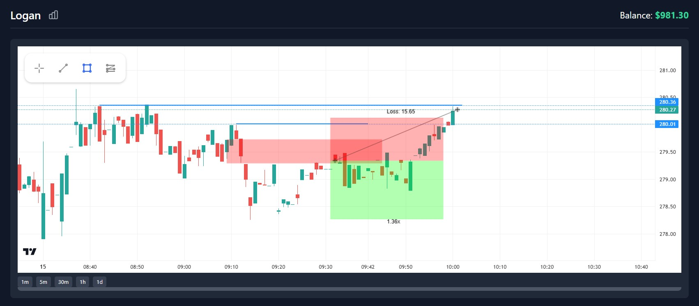
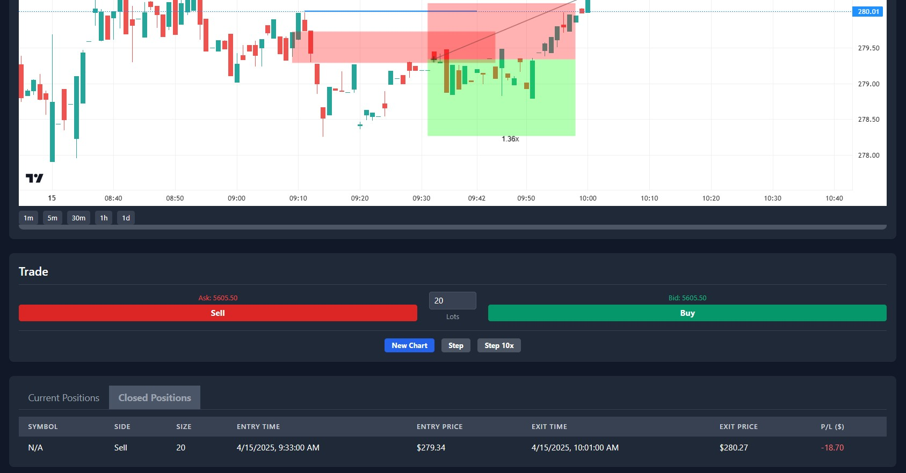
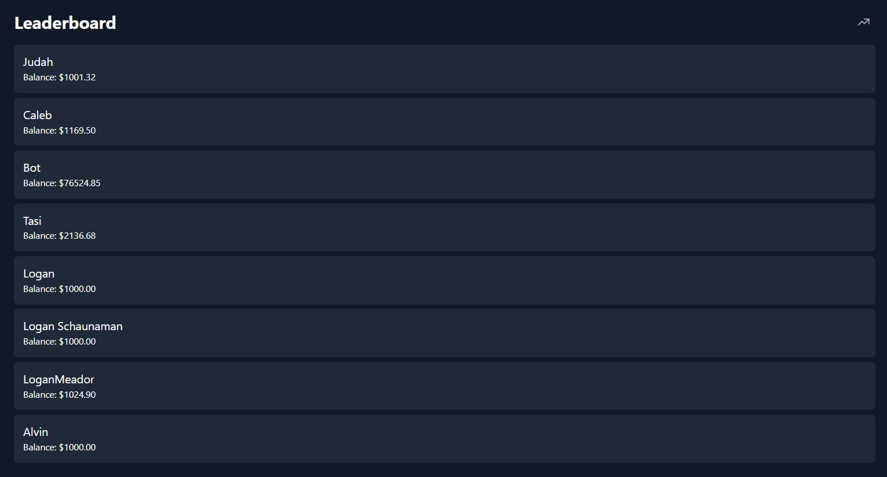
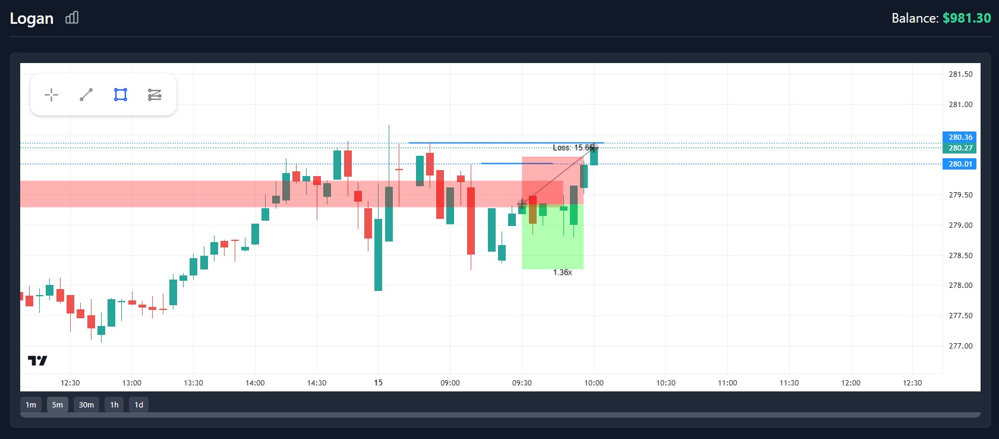

# **Candl** – Simple Backtesting for Traders  

**Candl** is a super clean and simple backtesting software made for day traders. Most trading platforms have way too many stats that don't even matter—Candl fixes that. It gives you exactly what you need to focus on **real** trading without the clutter.  

## Features  
- **Clean, lightweight charts** using TradingView's open-source library.  
- **Custom drawing tools** – Trend lines, boxes, stop-loss markers.  
- **Easy trade tracking** – See entry/exit price, time, side (buy/sell), P/L, etc.  
- **Leaderboard** – Compare stats with others & track balances.  
- **Trade analytics** – Win/loss ratio, buy vs. sell stats, timeline graph.  

---

## Screenshots

### Trading Interface  
Super clean charts + easy-to-use drawing tools.  
  

### Position Tracking  
See all your trades in one place.  
  

### Leaderboard  
Compete with other traders & track balances.  
  

### Trade Analytics  
See how your trading is doing over time.  
  

---

## ⚙️ Tech Stack  
- **Backend:** Node.js + MySQL  
- **Frontend:** HTML, CSS, JavaScript  
- **Charts:** TradingView Lightweight Charts

---

## Why I Made **Candl**
Trading software is bloated. Candl is simple. It helps traders focus on what matters, testing strategies, refining execution, and improving their game. No distractions, no nonsense.

